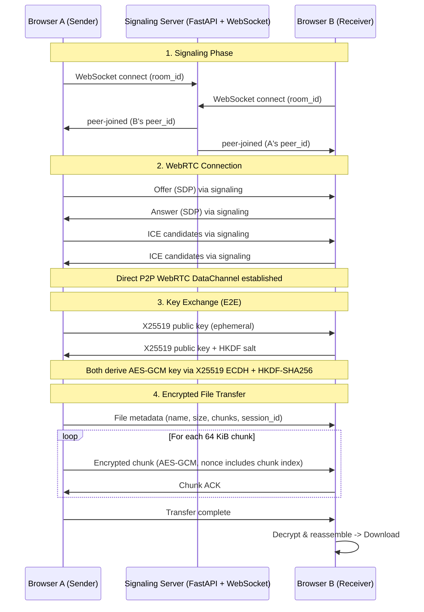

# SecureDrop-Lite

**E2E-encrypted browser-to-browser file sharing via WebRTC**

No server-side file storage. No database. No authentication. Pure P2P after signaling.

## Architecture



## Quickstart

### Local Development

```bash
# Clone and enter
git clone https://github.com/kamalesh404/SecureDrop-Lite.git
cd SecureDrop-Lite

# Install in editable mode (single command runs everything)
pip install -e .

# Run signaling server
securedrop-server
# Server runs at http://localhost:8080
```

Open `http://localhost:8080` in two browser tabs/windows. Create a room in one, join in the other. Select a file and send.

### Docker

```bash
# Build and run
docker-compose up --build

# Or build manually
docker build -t securedrop-lite .
docker run -p 8080:8080 securedrop-lite
```

### Production Deployment

```bash
# With Docker Compose (recommended)
docker-compose up -d

# Or with systemd
# Copy securedrop-lite.service to /etc/systemd/system/
# systemctl enable --now securedrop-lite
```

## Threat Model

### Protected Against

| Threat | Mitigation |
|--------|------------|
| **Server eavesdropping** | Signaling server only relays SDP/ICE; never sees plaintext |
| **Network interception** | All file data encrypted with AES-GCM over WebRTC (DTLS) |
| **Replay attacks** | Chunk index embedded in nonce; out-of-order/replay rejected |
| **Key compromise** | Ephemeral X25519 keys per session; forward secrecy |
| **Chunk tampering** | AES-GCM authentication tag validates integrity |
| **Man-in-the-middle (signaling)** | Peer verifies key fingerprints out-of-band (TODO: UI) |

### Not Protected Against

| Threat | Reason |
|--------|--------|
| **Signaling server MITM** | No identity verification; peers trust signaling server |
| **Peer impersonation** | No authentication; anyone with room ID can join |
| **Metadata leakage** | Room ID, peer IPs, file size/name visible to signaling server |
| **Denial of Service** | No rate limiting on signaling or WebRTC |
| **Malicious peer** | Receiver could be malicious; sender encrypts but receiver decrypts |

## Security Notes

- **Cryptography**: X25519 (ECDH) for key agreement, HKDF-SHA256 for key derivation, AES-256-GCM for encryption
- **Chunk size**: 64 KiB (balance between overhead and memory)
- **Nonce construction**: 4-byte chunk index || 8-byte random (prevents reuse)
- **Forward secrecy**: Ephemeral keys discarded after session
- **No persistent storage**: Nothing written to disk
- **Dependencies**: `cryptography` (Python), Web Crypto API (browser)

## Project Structure

```
SecureDrop-Lite/
├── src/securedrop_lite/
│   ├── __init__.py
│   ├── crypto.py          # Python crypto (testing/reference)
│   ├── server.py          # FastAPI + WebSocket signaling
│   └── static/
│       ├── index.html     # Frontend UI
│       ├── app.js         # WebRTC + transfer logic
│       └── crypto.js      # Web Crypto API (X25519 + AES-GCM)
├── tests/
│   ├── test_crypto.py
│   ├── test_signaling.py
│   └── test_chunk_reassembly.py
├── .github/workflows/ci.yml
├── Dockerfile
├── docker-compose.yml
├── pyproject.toml
├── LICENSE
└── README.md
```

## Development

```bash
# Install dev dependencies
pip install -e ".[dev]"

# Run tests
pytest -v

# Lint
ruff check src tests
ruff format src tests

# Type check (if mypy configured)
# mypy src
```

## API Endpoints

| Endpoint | Method | Description |
|----------|--------|-------------|
| `/` | GET | Serves frontend |
| `/health` | GET | Health check |
| `/ws/{room_id}` | WebSocket | Signaling (SDP/ICE relay) |

## Signaling Protocol

Messages are JSON over WebSocket.

### Server → Client

```json
{ "type": "welcome", "peer_id": "abc12345" }
{ "type": "peer-joined", "peer_id": "def67890" }
{ "type": "peer-left", "peer_id": "def67890" }
{ "type": "offer", "from": "abc12345", "offer": {...} }
{ "type": "answer", "from": "def67890", "answer": {...} }
{ "type": "ice-candidate", "from": "abc12345", "candidate": {...} }
```

### Client → Server (relayed to other peers)

```json
{ "type": "offer", "offer": {...}, "target": "def67890" }
{ "type": "answer", "answer": {...}, "target": "abc12345" }
{ "type": "ice-candidate", "candidate": {...}, "target": "def67890" }
```

### Data Channel Protocol (P2P, encrypted)

```json
{ "type": "key-exchange", "publicKey": [...], "sessionId": "..." }
{ "type": "key-exchange-ack", "salt": [...] }
{ "type": "file-meta", "fileName": "...", "fileSize": 12345, "totalChunks": 10, "sessionId": "...", "mimeType": "..." }
{ "type": "file-chunk", "index": 0, "data": [...] }
{ "type": "chunk-ack", "index": 0 }
{ "type": "transfer-complete", "sessionId": "..." }
{ "type": "transfer-cancel" }
```

## License

MIT License - see [LICENSE](LICENSE) for details.

## Contributing

1. Fork the repository
2. Create a feature branch
3. Make changes with tests
4. Ensure CI passes (`ruff` + `pytest`)
5. Submit a PR

## Changelog

### v0.1.0 (Initial Release)
- WebRTC data channel file transfer
- X25519 + AES-GCM encryption
- FastAPI signaling server
- Chunked transfer with resume capability
- Docker support
- CI/CD pipeline